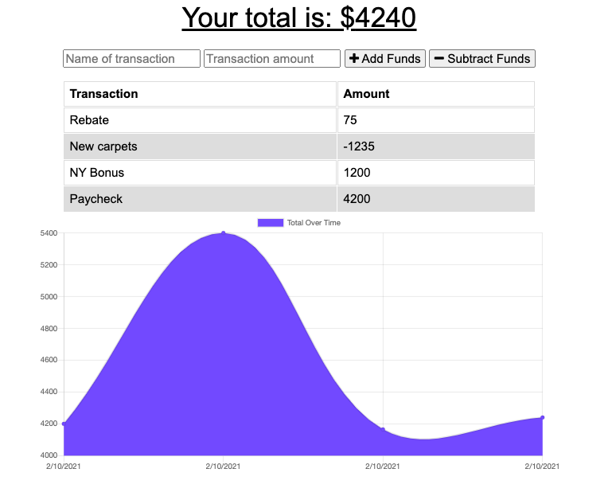

# Title: Budget Tracker

Samantha Peloquin

> Deployed Application: https://shrouded-citadel-91338.herokuapp.com/

## Table of Contents

- [Project Description](#description)
- [Installation Details](#installation)
- [User Interface](#Interface)
- [Usage](#usage)
- [Questions](#questions)

## Description

---

> _This application allows users to track their income and expenses. Using the budget tracker both online and offline has proven to be useful to those who are trying to track what they spend._

## Installation

---

> Instructions: npm i, npm start
>
> _To begin install please head on over to the repo found in the [Questions](#questions) section of this README_

## Interface

---

## Usage

---

> For users who are trying to become more financially aware of their spending habits the Budget Tracker is the perfect tool to start with. This tracker is available both online and off line, allowing users to add transactions without a connection.

## Questions

---

> _If you have any questions at all please don't hesitate to review the repo or email me directly_
>
>  > 
